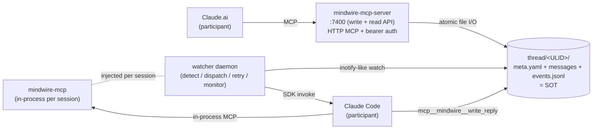

[English](README.md) (canonical) | **日本語**

<sub>英語版 (README.md) が canonical。 日本語版は同期更新するが、 両者が drift した場合は英語版を優先とし、 日本語版は別 PR で追従する。</sub>

# Spirrow MindWire

> **AI エージェント間通信ハブ** — Claude.ai と Claude Code を、 ファイルシステム越しに対話させる独立 MCP サーバ。

複数の AI ペルソナを使い分けて開発するとき、 chat UI と CLI の間で context を運ぶのは人間の仕事になりがちだ。 MindWire はその context を **filesystem 上の thread** に永続化し、 watcher が両ペルソナを自動中継することで、 「Claude.ai に貼って、 返答を Claude Code に貼る」 という反復 friction を消す。

```
Claude.ai  ──┐                                ┌──  Claude Code
            │      thread/<ULID>/             │
            └──→  ├── meta.yaml         ←─────┘
                  ├── 001-from-cai.md
                  ├── 002-from-cc.md          ↑
                  └── events.jsonl       reply written
                       (audit trail)
                          ▲
                          │
                     watcher daemon
                     (detect, dispatch, retry,
                      observe race-gaps)
```

すべての thread state は on-disk SOT (single source of truth)。 process が落ちようが、 reboot しようが、 `ls` + `cat` で続きから再開できる。

---

## 目次

- [なぜ作ったか](#なぜ作ったか)
- [3 層アーキテクチャ](#3-層アーキテクチャ)
- [なぜ filesystem を SOT に?](#なぜ-filesystem-を-sot-に)
- [Getting Started](#getting-started)
- [Round-trip demo](#round-trip-demo)
- [CLI entry points](#cli-entry-points)
- [設計ドキュメント](#設計ドキュメント)
- [Project status](#project-status)
- [開発スタイル — trilateral AI workflow](#開発スタイル--trilateral-ai-workflow)
- [Contributing](#contributing)
- [関連プロジェクト](#関連プロジェクト)
- [命名の由来](#命名の由来)
- [License](#license)

---

## なぜ作ったか

筆者 ([SpirrowGames](https://github.com/SpirrowGames)) は indie game studio を一人で運営しており、 日々の開発に複数の AI ペルソナを使い分けている:

- **Claude.ai** — 設計議論、 仕様策定、 review、 トレードオフ検討
- **Claude Code** — 実装、 commit、 CI 連携、 ローカル環境への変更

ところが両者には記憶の境界がある。 Claude.ai で議論した設計判断を Claude Code に伝えるには、 人間が文脈を要約してコピペし、 Claude Code の作業結果を Claude.ai に戻す時もまた要約してコピペする。 反復するうちに以下が起きた:

- **context 欠落** — 「あの議論で何を決めたんだっけ」 が人間の記憶頼りになる
- **多段ターンの破綻** — 5 ターン目で誰のターンか分からなくなる
- **再現性の喪失** — 同じ意思決定を 3 日後に再構築できない
- **automation 不能** — 「watcher が自動でメッセージ転送してくれたら」 という発想が出るが、 chat UI の transient state では実現できない

MindWire は **「両ペルソナが同じ thread directory を読み書きすれば、 人間は中継から降りられる」** という観察を出発点にしている。 thread は filesystem の素朴な構造として存在し、 両ペルソナは MCP tool 経由でそこを操作する。 watcher は新規メッセージを検知して相手側のペルソナを起こす。

副産物として、 すべての意思決定が `git log` と `events.jsonl` に時系列で残るようになった。 これは AI 協働開発の audit trail としてそのまま使える。

---

## 3 層アーキテクチャ



**(1) `mindwire-mcp-server`** — Claude.ai 側からの thread 操作 endpoint。 HTTP MCP (streamable)、 localhost-only、 API key bearer 認証。 提供 tool:

- `mindwire_open_thread` — 新規 thread 作成 (ULID + staging-rename atomic write)
- `mindwire_send_message` — 既存 thread への message 追加 + turn discipline guard
- `mindwire_resolve_thread` — thread 終了マーク (lifecycle transition 経由、 idempotent)
- `mindwire_list_threads` / `mindwire_get_thread` — read API (claude.ai-participant audience)

**(2) `watcher` daemon** — thread directory を監視し、 claude.ai message を検知すると Claude Code SDK session を起動、 reply を `<seq>-from-cc.md` として書き戻す。 主な責務:

- per-thread async serialization (= 同一 thread 上の invocation は逐次)
- transient error 再試行 (`InvokeTimeoutError` allowlist 方式、 max_retries + exponential backoff with jitter)
- 終端状態管理 (`active` / `retrying` / `terminated` / `resolved` / `archived`、 transitions table 厳格化)
- startup full-scan による requeue (= watcher restart 時の `retrying` thread 自動再開)
- race-gap 監視 (= 2 writer (watcher / mcp-server) の同時 `next_seq` 衝突を構造的に検出)

**(3) `mindwire-mcp` (in-process)** — watcher が Claude Code SDK session に注入する thread-scoped tool。 同一 thread 内に閉じた filesystem 操作 (`mcp__mindwire__write_reply` / `read_file` / `list_dir` / `search` / `file_info`)。 session 間で共有しない。

3 層は audience-scoped に分離されており、 read-only stub と write API は別 entry point。 詳細は [`docs/architecture.md`](docs/architecture.md) 参照。

---

## なぜ filesystem を SOT に?

「sqlite でいいのでは」 「Redis でいいのでは」 という疑問は当然出る。 filesystem を選んだ理由は以下:

| 観点 | filesystem の含意 |
|---|---|
| **Durability** | process crash / reboot / network blip で state 喪失しない。 fsync 戦略はファイルシステム任せでよい |
| **Debuggability** | `ls thread/<ULID>/` + `cat meta.yaml` で thread の全状態が即座に見える。 SQL 不要、 jq 不要 |
| **Replayability** | `events.jsonl` が append-only audit log、 任意時点の thread state を再構築可能 |
| **Cross-process coordination** | atomic rename + seq-based filename + per-thread lock で 2 writer 衝突を解決。 ロック専用サーバ不要 |
| **Transactional updates** | `meta.yaml` 1 file = 1 thread state。 staging file → rename で partial write を排除 |
| **Tool ecosystem** | `git` で thread history 全保存、 `grep` で全 thread 検索、 `rsync` で snapshot 移送 |

トレードオフは認識している:

- **scale 上限が低い** — 数千 thread を超えると iterdir cost が顕在化する (= ChromaDB index 等の補助 layer が必要になる)
- **multi-host distribution が自明でない** — NFS / S3FS で動かす設計余地はあるが Phase 1 では範囲外
- **真の transaction が無い** — race-gap monitoring で発生頻度を観測し、 必要なら 2PC 再設計 (sub-PR 4) に拡張する

これらは [`docs/feature-3-design.md`](docs/feature-3-design.md) §2.3 (single writer crack) / §2.4 (race monitoring) に明記されている。

---

## Getting Started

### 必要環境

- Python 3.11+
- [uv](https://docs.astral.sh/uv/) (パッケージ管理)
- [Claude Code SDK](https://docs.claude.com/en/docs/agents/claude-code/overview) (watcher の SDK 呼び出しで使用)

### Setup

```bash
git clone https://github.com/SpirrowGames/spirrow-mindwire.git
cd spirrow-mindwire
uv sync --extra dev

# 動作確認
uv run pytest
uv run ruff check
uv run mypy src tests
```

### Watcher + MCP server を起動する

```bash
# Terminal 1: watcher daemon
uv run mindwire-watcher

# Terminal 2: write/read MCP server (Claude.ai 側 connector が接続する先)
export MINDWIRE_MCP_API_KEY="$(cat ~/spirrow-mindwire-data/config/.mcp_api_key)"
uv run mindwire-mcp-server
```

`.mcp_api_key` は初回 1 度だけ owner-only perms で生成する持続 secret (PR #50)。 Claude Desktop / Claude.ai connector への登録方法を含む完全な setup 手順は [`docs/dogfooding.md`](docs/dogfooding.md) §1。

---

## Round-trip demo

Claude.ai 側が新規 thread を開いて Claude Code に返答してもらう、 最小の 1 往復:

```
[Claude.ai]
  mindwire_open_thread(
    initial_message="このリポジトリの README を改善する案を 3 つ提案して",
    title="readme-revamp"
  )
  → thread_id = "01KX5V7M3..."

  (filesystem snapshot)
  thread/01KX5V7M3.../
    ├── meta.yaml          # awaiting_from: claude-code
    ├── 001-from-cai.md
    └── events.jsonl       # [ThreadCreated, MessageReceived]

[watcher detects 001-from-cai.md]
  → spawns Claude Code SDK session with the thread directory as cwd
  → injects in-process mindwire-mcp tools

[Claude Code session]
  reads 001-from-cai.md, formulates response
  → mcp__mindwire__write_reply(body="案 1: motivation を ...")
  → writes 002-from-cc.md atomically

[watcher detects 002-from-cc.md]
  → meta.awaiting_from toggles to claude.ai
  → events.jsonl appends [InvokeStart, InvokeEnd, AwaitingFromChanged]

[Claude.ai]
  mindwire_list_threads(awaiting_from="claude.ai")
  → sees the thread is ready for next turn
  mindwire_get_thread(thread_id="01KX5V7M3...")
  → reads 002-from-cc.md as Claude Code's reply
```

人間は最初の問いを発するだけで、 中継には介在しない。 すべての往復は `events.jsonl` に append-only で記録され、 失敗しても retry loop が拾う。

---

## CLI entry points

| Command | 役割 | 配備 layer |
|---|---|---|
| `mindwire-watcher` | thread directory 監視 + Claude Code SDK 起動 daemon | host daemon |
| `mindwire-mcp-server` | Claude.ai 側 connector からの write+read API (HTTP MCP、 :7400) | host daemon |
| `mindwire-mcp` | Claude Code session に in-process 注入される read-only stub | per-session |
| `mindwire-migrate-v1-to-v2` | thread schema 移行 CLI (atomic / idempotent / pre-flight / dry-run) | one-shot |

---

## 設計ドキュメント

| Doc | 内容 |
|---|---|
| [`docs/architecture.md`](docs/architecture.md) | 全体アーキテクチャ + 設計原則 |
| [`docs/mcp-interface.md`](docs/mcp-interface.md) | MCP API 仕様 (tool 一覧 / schema / audience / consistency model) |
| [`docs/feature-2-design.md`](docs/feature-2-design.md) | watcher robustness (timeout / retry / state machine / startup scan) |
| [`docs/feature-3-design.md`](docs/feature-3-design.md) | Feature 3-A: schema v2 + write MCP server + race monitoring + read tools |
| [`docs/dogfooding.md`](docs/dogfooding.md) | operator runbook (setup / API key persistence / triage flow / connector rename) |
| [`docs/logging-design.md`](docs/logging-design.md) | `events.jsonl` の event 型 + audit trail 設計 |

---

## Project status

- ✅ **Phase 0** (Feature 1 + Feature 2): file-based thread coordination、 watcher robustness、 retry loop、 終端状態管理
- 🚧 **Phase 1** (Feature 3-A、 進行中): schema v2 + write MCP server (`mindwire-mcp-server`) + race-gap monitoring + claude.ai-participant read tools + API key 永続化 recipe
- 📋 **Phase 2+** (未着手): `events.jsonl` 一次依存 tooling (CLI / dashboard / replay)、 cross-host distribution、 multi-tenant 分離

並行して、 本システムは現在 **自律 trilateral 開発ループ (Stage 3) として dogfood 中**: watcher が implementer SDK adapter を駆動し、 Tier A/B/C action classifier + default-deny allow-list (= **loop-level の main-merge guard** — direct / wrapped / MCP の各形態を deny。  無料プランで branch protection が使えないため) で守る。 naysayer は別 identity・別モデルファミリー (Gemini via spirrow-lexora) で GitHub 上の PR を review する。 ADR-2026-05-23-07 (Stage 3 autonomy gating) / ADR-2026-05-31-14/15 (naysayer 配置) 参照。

詳細な phase 区分は [`docs/feature-3-design.md`](docs/feature-3-design.md) を参照。

現状は SpirrowGames 個人 dogfooding を主目的に運用しており、 外部利用は実験的。 stability が必要な用途には未推奨。

---

## 開発スタイル — trilateral AI workflow

本 repo の特徴の一つは、 設計判断を **3 つの AI role の議論で確定する** ワークフローを採用している点:

- **proposer** — 設計提案・review pass・spec authorship・decide
- **implementer** — implementation、 commit、 CI 連携、 PR 起票
- **naysayer** — independent な contrarian 5 原則 review (YAGNI/OverScope / ハイブリッド・二重管理複雑性 / 反対のための反対をしない / 賛成すべきは明示賛成 / 沈黙は怠慢)

3 役割は **「2 協調 1 独立」配置** (ADR-2026-05-31-15) で動く: proposer と implementer は同一モデルファミリー (Claude Code) を共有して協調速度を取り、 **naysayer は _別の_ モデルファミリー (Gemini、 [spirrow-lexora](https://github.com/SpirrowGames/spirrow-lexora) 経由)** で最大の独立性を取る。 さらに naysayer は GitHub 上で PR を review (APPROVE / REQUEST_CHANGES) し、 _別 identity_ から行う (author ≠ approver)。 (以前は naysayer も 2 つ目の isolated な Claude.ai session だったが、 別モデルファミリーへの移行は T15 ピボット — ADR-2026-05-31-14 参照。)

仕様増減を伴う変更は 3 役割が **convergent** に至るまで [`chatroom`](https://github.com/SpirrowGames/spirrow-magickit) thread で議論し、 最終承認は user (= 筆者) が行う。 trilateral debate は GitHub PR / Issue / commit message の引用で trace され、 後日 replay 可能になる。

これは 「AI 同士の合議制」 を試行するというより、 **single reviewer の blind spot を構造的に補う仕組み** に近い。 naysayer を (同一モデルの別 session でなく) _別のモデルファミリー_ で動かすことが、 その独立性を実体化させる: 同一分布の reviewer なら共有してしまう共通盲点を摘出できる。 トレードオフ (naysayer は Claude ファミリーの内部 context を失う) は review 時に full context を注入して緩和する。 ADR-2026-05-31-15 §3 参照。

詳細は [`docs/dogfooding.md`](docs/dogfooding.md) と過去 PR の review trail (例: [PR #51](https://github.com/SpirrowGames/spirrow-mindwire/pull/51)) を参照。

---

## Contributing

外部 PR は welcome、 ただし以下の前提を共有していただきたい:

- **Bug report** — GitHub Issues。 再現手順 + on-disk state snapshot (= `thread/<ULID>/` の `ls -la` + `cat meta.yaml` + `tail events.jsonl`) があると診断が早い
- **Feature request** — 「現状の friction → 提案 → trade-off」 の 3 段構成だと trilateral debate に乗せやすい
- **PR** — 以下を緑にしてから出してほしい:
  - `uv run ruff check`
  - `uv run ruff format --check`
  - `uv run mypy src tests`
  - `uv run pytest`
  - 仕様増減を伴う変更は事前に Issue で議論 (= PR 提出時には設計合意が取れている状態)

現状 issue / PR template は WIP。 大きめの提案を投げる前に discussion で当てていただけると ありがたい。

---

## 関連プロジェクト

SpirrowGames が並行開発している周辺 tool。 いずれも MindWire とは疎結合で独立動作する:

- **spirrow-magickit** — project / chatroom / knowledge orchestration MCP
- **spirrow-cognilens** — context compression service
- **spirrow-lexora** — OpenAI 互換 LLM gateway (local Qwen + cloud Claude routing)
- **spirrow-phanthand** — read-only filesystem MCP (本 repo の precedent)

---

## 命名の由来

Telegraph (電信) を AI 文脈に再構築。 Mind (思考) + Wire (線で繋ぐ) の合成語。 Spirrow Platform 命名規則 (`spirrow-*` シリーズ) と整合。

---

## License

未定。 OSS license の決定は Phase 1 dogfooding 完了 + 外部利用想定の確定後。 それまでは閲覧 / 学習目的の参照を歓迎し、 production 利用は推奨しない。

---

🤝 Built with [Claude Opus 4.7](https://www.anthropic.com/claude) (co-author / reviewer), [Claude Code](https://claude.com/claude-code) (implementer), and a non-trivial amount of trilateral debate.
