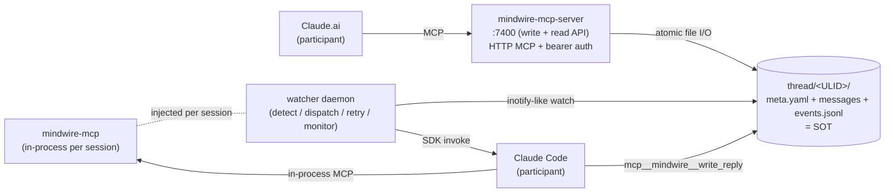

# Spirrow MindWire

**English** (canonical) | [日本語](README.ja.md)

<sub>The English README is canonical. The Japanese version is kept in sync; if the two drift, the English version takes precedence and the Japanese one is updated to follow in a separate PR.</sub>

> **An inter-AI-agent communication hub** — a standalone MCP server that lets Claude.ai and Claude Code converse with each other across the filesystem.

When you develop by switching between several AI personas, carrying context between a chat UI and a CLI tends to become the human's job. MindWire persists that context into **threads on the filesystem**, and a watcher auto-relays both personas — eliminating the repetitive friction of "paste into Claude.ai, then paste its reply into Claude Code."

```
Claude.ai  ──┐                                ┌──  Claude Code
            │      thread/<ULID>/             │
            └──→  ├── meta.yaml         ←─────┘
                  ├── 001-from-cai.md
                  ├── 002-from-cc.md          ↑
                  └── events.jsonl       reply written
                       (audit trail)
                          ▲
                          │
                     watcher daemon
                     (detect, dispatch, retry,
                      observe race-gaps)
```

All thread state is an on-disk SOT (single source of truth). Whether a process dies or the machine reboots, you can resume from where you left off with nothing more than `ls` + `cat`.

---

## Table of contents

- [Why this exists](#why-this-exists)
- [Three-layer architecture](#three-layer-architecture)
- [Why filesystem as the SOT?](#why-filesystem-as-the-sot)
- [Getting Started](#getting-started)
- [Round-trip demo](#round-trip-demo)
- [CLI entry points](#cli-entry-points)
- [Design documents](#design-documents)
- [Project status](#project-status)
- [Development style — trilateral AI workflow](#development-style--trilateral-ai-workflow)
- [Contributing](#contributing)
- [Related projects](#related-projects)
- [Name origin](#name-origin)
- [License](#license)

---

## Why this exists

The author ([SpirrowGames](https://github.com/SpirrowGames)) runs an indie game studio solo, and uses several AI personas day to day:

- **Claude.ai** — design discussion, spec authorship, review, trade-off analysis
- **Claude Code** — implementation, commits, CI integration, changes to the local environment

But the two have a memory boundary between them. To convey a design decision discussed in Claude.ai to Claude Code, a human has to summarize the context and copy-paste it; when Claude Code's work comes back, it again has to be summarized and pasted into Claude.ai. As this repeated, the following emerged:

- **Context loss** — "what did we decide in that discussion again?" comes to depend on human memory
- **Multi-turn breakdown** — by the fifth turn it becomes unclear whose turn it is
- **Loss of reproducibility** — the same decision cannot be reconstructed three days later
- **No automation** — the idea "what if a watcher just forwarded the messages automatically" arises, but cannot be realized on a chat UI's transient state

MindWire starts from the observation that **"if both personas read and write the same thread directory, the human can step out of the relay."** A thread exists as a plain filesystem structure, and both personas operate on it via MCP tools. The watcher detects new messages and wakes the other persona.

As a side effect, every decision is now left in chronological order in `git log` and `events.jsonl`. This works as-is as an audit trail for AI-collaborative development.

---

## Three-layer architecture



**(1) `mindwire-mcp-server`** — the thread-operation endpoint from the Claude.ai side. HTTP MCP (streamable), localhost-only, API-key bearer auth. Tools provided:

- `mindwire_open_thread` — create a new thread (ULID + staging-rename atomic write)
- `mindwire_send_message` — append a message to an existing thread + turn-discipline guard
- `mindwire_resolve_thread` — mark a thread as finished (via lifecycle transition, idempotent)
- `mindwire_list_threads` / `mindwire_get_thread` — read API (claude.ai-participant audience)

**(2) `watcher` daemon** — watches the thread directory, and when it detects a claude.ai message it spawns a Claude Code SDK session and writes the reply back as `<seq>-from-cc.md`. Main responsibilities:

- per-thread async serialization (= invocations on the same thread run sequentially)
- transient-error retry (`InvokeTimeoutError` allowlist approach, max_retries + exponential backoff with jitter)
- terminal-state management (`active` / `retrying` / `terminated` / `resolved` / `archived`, with a strict transitions table)
- requeue via startup full-scan (= automatic resumption of `retrying` threads on watcher restart)
- race-gap monitoring (= structural detection of simultaneous `next_seq` collisions between the 2 writers (watcher / mcp-server))

**(3) `mindwire-mcp` (in-process)** — thread-scoped tools the watcher injects into the Claude Code SDK session. Filesystem operations closed within a single thread (`mcp__mindwire__write_reply` / `read_file` / `list_dir` / `search` / `file_info`). Not shared across sessions.

The three layers are separated audience-scoped; the read-only stub and the write API are distinct entry points. See [`docs/architecture.md`](docs/architecture.md) for details.

---

## Why filesystem as the SOT?

"Why not just sqlite?" "Why not just Redis?" are natural questions. The reasons filesystem was chosen:

| Aspect | What the filesystem implies |
|---|---|
| **Durability** | State is not lost on process crash / reboot / network blip. The fsync strategy can be left to the filesystem |
| **Debuggability** | `ls thread/<ULID>/` + `cat meta.yaml` shows the entire thread state instantly. No SQL, no jq |
| **Replayability** | `events.jsonl` is an append-only audit log; the thread state at any point in time can be reconstructed |
| **Cross-process coordination** | atomic rename + seq-based filename + per-thread lock resolves 2-writer collisions. No dedicated lock server |
| **Transactional updates** | `meta.yaml` 1 file = 1 thread state. staging file → rename eliminates partial writes |
| **Tool ecosystem** | `git` preserves the full thread history, `grep` searches across all threads, `rsync` ships snapshots |

The trade-offs are acknowledged:

- **Low scale ceiling** — beyond a few thousand threads, iterdir cost becomes visible (= an auxiliary layer such as a ChromaDB index becomes necessary)
- **Multi-host distribution is not obvious** — there is design room to run it on NFS / S3FS, but that is out of scope for Phase 1
- **No true transactions** — race-gap monitoring observes the frequency of occurrence, and if needed it extends to a 2PC redesign (sub-PR 4)

These are documented in [`docs/feature-3-design.md`](docs/feature-3-design.md) §2.3 (single writer crack) / §2.4 (race monitoring).

---

## Getting Started

### Requirements

- Python 3.11+
- [uv](https://docs.astral.sh/uv/) (package management)
- [Claude Code SDK](https://docs.claude.com/en/docs/agents/claude-code/overview) (used by the watcher's SDK invocation)

### Setup

```bash
git clone https://github.com/SpirrowGames/spirrow-mindwire.git
cd spirrow-mindwire
uv sync --extra dev

# Sanity check
uv run pytest
uv run ruff check
uv run mypy src tests
```

### Starting the watcher + MCP server

```bash
# Terminal 1: watcher daemon
uv run mindwire-watcher

# Terminal 2: write/read MCP server (the endpoint the Claude.ai-side connector connects to)
export MINDWIRE_MCP_API_KEY="$(cat ~/spirrow-mindwire-data/config/.mcp_api_key)"
uv run mindwire-mcp-server
```

`.mcp_api_key` is a persistent secret generated once with owner-only perms (PR #50). The complete setup procedure, including how to register it with the Claude Desktop / Claude.ai connector, is in [`docs/dogfooding.md`](docs/dogfooding.md) §1.

---

## Round-trip demo

The minimal single round-trip where the Claude.ai side opens a new thread and has Claude Code reply:

```
[Claude.ai]
  mindwire_open_thread(
    initial_message="Propose 3 ways to improve this repo's README",
    title="readme-revamp"
  )
  → thread_id = "01KX5V7M3..."

  (filesystem snapshot)
  thread/01KX5V7M3.../
    ├── meta.yaml          # awaiting_from: claude-code
    ├── 001-from-cai.md
    └── events.jsonl       # [ThreadCreated, MessageReceived]

[watcher detects 001-from-cai.md]
  → spawns Claude Code SDK session with the thread directory as cwd
  → injects in-process mindwire-mcp tools

[Claude Code session]
  reads 001-from-cai.md, formulates response
  → mcp__mindwire__write_reply(body="Idea 1: lead with motivation ...")
  → writes 002-from-cc.md atomically

[watcher detects 002-from-cc.md]
  → meta.awaiting_from toggles to claude.ai
  → events.jsonl appends [InvokeStart, InvokeEnd, AwaitingFromChanged]

[Claude.ai]
  mindwire_list_threads(awaiting_from="claude.ai")
  → sees the thread is ready for next turn
  mindwire_get_thread(thread_id="01KX5V7M3...")
  → reads 002-from-cc.md as Claude Code's reply
```

The human only poses the initial question and never intervenes in the relay. Every round-trip is recorded append-only in `events.jsonl`, and even on failure the retry loop picks it up.

---

## CLI entry points

| Command | Role | Deployment layer |
|---|---|---|
| `mindwire-watcher` | thread-directory watching + Claude Code SDK launch daemon | host daemon |
| `mindwire-mcp-server` | write+read API from the Claude.ai-side connector (HTTP MCP, :7400) | host daemon |
| `mindwire-mcp` | read-only stub injected in-process into the Claude Code session | per-session |
| `mindwire-migrate-v1-to-v2` | thread schema migration CLI (atomic / idempotent / pre-flight / dry-run) | one-shot |

---

## Design documents

| Doc | Content |
|---|---|
| [`docs/architecture.md`](docs/architecture.md) | Overall architecture + design principles |
| [`docs/mcp-interface.md`](docs/mcp-interface.md) | MCP API spec (tool list / schema / audience / consistency model) |
| [`docs/feature-2-design.md`](docs/feature-2-design.md) | watcher robustness (timeout / retry / state machine / startup scan) |
| [`docs/feature-3-design.md`](docs/feature-3-design.md) | Feature 3-A: schema v2 + write MCP server + race monitoring + read tools |
| [`docs/dogfooding.md`](docs/dogfooding.md) | operator runbook (setup / API key persistence / triage flow / connector rename) |
| [`docs/logging-design.md`](docs/logging-design.md) | `events.jsonl` event types + audit-trail design |

---

## Project status

- ✅ **Phase 0** (Feature 1 + Feature 2): file-based thread coordination, watcher robustness, retry loop, terminal-state management
- 🚧 **Phase 1** (Feature 3-A, in progress): schema v2 + write MCP server (`mindwire-mcp-server`) + race-gap monitoring + claude.ai-participant read tools + API-key persistence recipe
- 📋 **Phase 2+** (not started): `events.jsonl`-primary tooling (CLI / dashboard / replay), cross-host distribution, multi-tenant isolation

See [`docs/feature-3-design.md`](docs/feature-3-design.md) for the detailed phase breakdown.

It is currently operated mainly for SpirrowGames personal dogfooding; external use is experimental. Not recommended for uses that need stability.

---

## Development style — trilateral AI workflow

One distinctive feature of this repo is that it adopts a workflow where **design decisions are settled by a debate among three AI roles**:

- **Claude.ai (main)** — design proposals, review pass, spec authorship
- **Claude.ai (naysayer)** — independent verification, contrarian review in a fully isolated session under 4 principles (YAGNI / no opposition for opposition's sake / explicitly endorse what should be endorsed / silence is negligence)
- **Claude Code** — implementation, commits, CI integration, integrator decide

Changes that involve a spec increase or decrease are discussed in a [`chatroom`](https://github.com/SpirrowGames/spirrow-magickit) thread until the 3 roles reach **convergence**, with final approval given by the user (= the author). The trilateral debate is traced via citations in GitHub PRs / Issues / commit messages, and becomes replayable later.

This is less an attempt at "consensus governance among AIs" and closer to **a mechanism that structurally compensates for a single reviewer's blind spots**. Because the naysayer does not hold the main reviewer's context at all, it serves to flush out biases that don't share the same premises.

See [`docs/dogfooding.md`](docs/dogfooding.md) and the review trail of past PRs (e.g. [PR #51](https://github.com/SpirrowGames/spirrow-mindwire/pull/51)) for details.

---

## Contributing

External PRs are welcome, but please share the following premises:

- **Bug report** — GitHub Issues. Diagnosis is faster with reproduction steps + an on-disk state snapshot (= `ls -la` of `thread/<ULID>/` + `cat meta.yaml` + `tail events.jsonl`)
- **Feature request** — a 3-part structure of "current friction → proposal → trade-off" is easier to put on the trilateral debate
- **PR** — please get the following green before submitting:
  - `uv run ruff check`
  - `uv run ruff format --check`
  - `uv run mypy src tests`
  - `uv run pytest`
  - changes involving a spec increase/decrease should be discussed in an Issue beforehand (= design agreement is reached by the time the PR is submitted)

The issue / PR templates are currently WIP. It would be appreciated if you sound out larger proposals in a discussion before throwing them.

---

## Related projects

Peripheral tools SpirrowGames develops in parallel. All are loosely coupled with MindWire and operate independently:

- **spirrow-magickit** — project / chatroom / knowledge orchestration MCP
- **spirrow-cognilens** — context compression service
- **spirrow-lexora** — OpenAI-compatible LLM gateway (local Qwen + cloud Claude routing)
- **spirrow-phanthand** — read-only filesystem MCP (the precedent for this repo)

---

## Name origin

A reconstruction of the telegraph in an AI context. A portmanteau of Mind (thought) + Wire (connecting with a line). Consistent with the Spirrow Platform naming convention (the `spirrow-*` series).

---

## License

Undecided. The OSS license decision will be made after Phase 1 dogfooding is complete and external-use assumptions are settled. Until then, reference for viewing / learning purposes is welcome, and production use is not recommended.

---

🤝 Built with [Claude Opus 4.7](https://www.anthropic.com/claude) (co-author / reviewer), [Claude Code](https://claude.com/claude-code) (implementer), and a non-trivial amount of trilateral debate.
